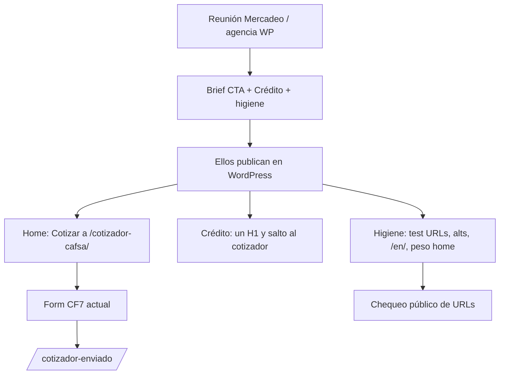
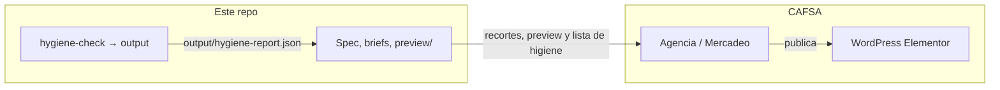
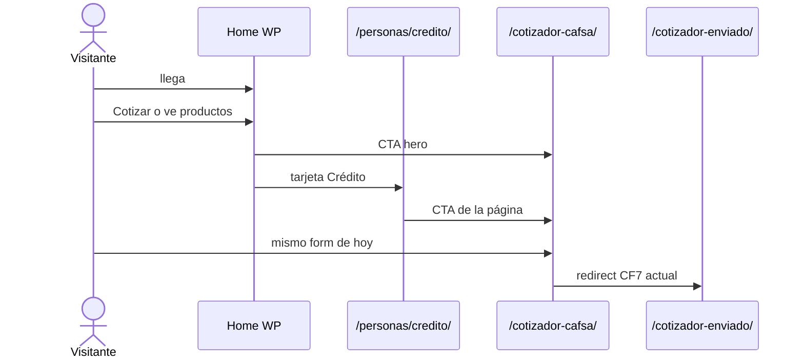

# Especificación de implementación CAFSA

Documento de diseño. No es el sitio en producción. No usa datos internos de CAFSA.

**Oferta:** dejar el cotizador a un clic y limpiar lo que ya se ve por fuera. Se publica en **su WordPress**. En este repo hay briefs y una vista previa **rotulada** (no es producción).

Relacionado: `cafsa-proposal.md` (oferta al cliente, alineada) y `cafsa-commercial-discovery.md` (nota interna).

---

## 1. Problemas que sí va a resolver

### Pregunta de negocio

El sitio ya tiene un flujo de cotización público. El home no lo pone a un clic. Además hay fallas visibles desde fuera (headings, inglés, URLs de prueba, peso). Esta oferta resuelve **ese canal y esa higiene**, no “si el web origina la cartera”.

### Problemas observables (24 ago 2026)

Revisión externa a [cafsa.fi.cr](https://cafsa.fi.cr/). No prueban pérdida de créditos.

| Problema | Qué se vio | Qué resuelve esta oferta |
| --- | --- | --- |
| Cotizador poco visible | Existen `/cotizador-cafsa/` y `/cotizador-enviado/`; el hero no tenía CTA claro hacia ese flujo | Botón **Cotizar** en el hero al form actual |
| Productos mudos | Iconos casi sin texto ni siguiente paso | Tarjetas + página Crédito con un H1, requisitos, salto al cotizador |
| Home pesado (esa visita) | FCP ~4,5 s, ~170 scripts, Maps y reCAPTCHA en el home | Recortar scripts del home (Maps fuera; no tocar sucursales) |
| Accesibilidad básica | Home sin `h1`; alts y links vacíos | Headings, alts, skip, foco, labels en home y Crédito |
| Inglés roto | `/en/` → 403 (GTranslate) | Páginas `/en/` reales **o** ocultar el toggle |
| URLs de prueba | `/test-menu/`, `/test-form-fase2/`, `/step-2/` en 200 | Despublicar o `noindex` |
| SEO vacío | Sin meta description; `og:locale` es_MX; sitemap en `http` | Descriptions en home y Crédito; sitemap https; locale `es_CR` |

### Alcance de trabajo (tres piezas, no tres etapas de software)

1. **CTA Cotizar** — hero → `/cotizador-cafsa/`. Mismo CF7. Copy: `Cotizar`.
2. **Página Crédito** — un H1, para quién es, vs leasing, requisitos, enlace al cotizador. No cinco H1 ni collage de banners.
3. **Higiene** — test URLs, alts/links vacíos, `/en/`, peso del home, meta descriptions.

Medir clicks/envíos con GA es **opcional** y solo si CAFSA da acceso. No bloquea el diseño ni el brief de WordPress.

---

## 2. Qué no se va a implementar

- Clon o rediseño de todo `cafsa.fi.cr` (noticias, gobierno corporativo, tarifario, comparadores SUGEF, sucursales, PYMES/Empresas enteras).
- Sitio Next.js / `stage-3/` como producto de esta oferta.
- Prototipo vendido como si los clientes ya estuvieran mejor en `cafsa.fi.cr`. Sí hay `experiment/preview/`: HTML de propuesta, con aviso en cada página.
- Simulador de cuotas, preaprobación, chatbot, app, `ibanking.cafsa.fi.cr`.
- Reemplazar a EGO ni cambiar logo, paleta ni foto de movilidad.
- Prometer más créditos, ranking SEO o cumplimiento SUGEF / Ley 7600 / 8968.
- Inventar leads, mix web vs agencia, o que el cotizador “no se usa”.
- Quitar el carousel de campañas **sin** que Mercadeo lo autorice (pueden ser slots de feria/fraude/app). El CTA se **añade**; no se asume borrar slides.
- Landing Expomóvil completa (tasas legales) sin brief de ellos.

---

## 3. Herramientas

Se trabaja sobre lo que **ya tienen**.

| Uso | Herramienta |
| --- | --- |
| Sitio real | WordPress + Elementor (y lo que ya esté; no sumar otro builder) |
| Quién publica | Equipo CAFSA o su agencia |
| Recortes | `experiment/cta-hero.*`, `pagina-credito.md`, `higiene-wp.md` |
| Vista previa (no producción) | `experiment/preview/` (HTML estático) |
| Chequeo público | `node tools/hygiene-check.mjs` (usa `curl`) → `output/hygiene-report.json` |
| Marca | Negro, rojo, blanco, logo CAFSA, foto de movilidad actual |
| Accesibilidad | Headings, alt, skip, foco, 44px, contraste del texto del hero (capa oscura si hace falta) |
| Performance | No cargar Maps ni reCAPTCHA en el home; diferir lo que no sea del hero |
| Medición (opcional) | GTM/GA4: `hero_cotizar_click`; página `/cotizador-enviado/` |

No: Next.js, Vercel como “el sitio CAFSA”, WPBakery+RevSlider nuevos, ni CMS paralelo.

---

## 4. Ruta de carpetas

Estado en el repo (no confundir con `cafsa.fi.cr`):

```
cafsa-web/
├── cafsa-proposal.md
├── cafsa-commercial-discovery.md
├── cafsa-implementation-spec.md
├── data/                # Vacía de CSV (CAFSA no ha entregado export)
├── experiment/
│   ├── cta-hero.md / cta-hero.html
│   ├── pagina-credito.md
│   ├── higiene-wp.md
│   ├── gtm-events.json
│   └── preview/         # HTML de propuesta (aviso en cada página)
├── tools/hygiene-check.mjs
├── stage-3/             # Vacía de producto (README de alcance)
└── output/hygiene-report.json
```

Producción: `cafsa.fi.cr` (WordPress). Fuera: `ibanking.cafsa.fi.cr`.

### `experiment/`

**Hecho en el repo**

- Brief + recorte CTA (`cta-hero.md`, `cta-hero.html`).
- Brief Crédito (`pagina-credito.md`).
- Eventos GTM (`gtm-events.json`).
- Checklist higiene (`higiene-wp.md`).
- Vista previa HTML (`preview/index.html`, `preview/credito.html`): H1, skip, tarjetas, CTA al cotizador **real**. Banner: no es producción.

**No hecho (y no se hace desde este repo)**

- Publicar en `cafsa.fi.cr`.
- CF7 nuevo / thank-you nuevo.
- Next.js ni `stage-3/` como app.
- Rediseño de mega menú.

### `data/`

**Hecho:** carpeta lista. **No hay CSV** (nadie lo entregó).

**No se va a implementar**

- Que el trabajo de diseño/WP espere al CSV.
- Leads inventados, conector automático a su GA, mix agencia vs web.

### `output/`

**Hecho:** `output/hygiene-report.json` (24 ago 2026, `curl` vía el script). `metrics: null`.

**No se va a implementar**

- Dashboard, informe legal, PDF de “rediseño ya en producción”.

### `tools/`

**Hecho:** `tools/hygiene-check.mjs` (GET con `curl`; Node fetch falla el TLS del host).

**No se va a implementar**

- App, login, scraper de forms. El producto es WordPress, no este script.

### `stage-3/`

**Hecho:** sin app. Hay `README.md` de alcance (además de `.gitkeep`).

**No se va a implementar**

- Next.js, cotizador nuevo, “canal de originación” como software. Queda fuera de esta oferta.

### Raíz (los `.md`)

**Hecho:** spec, `cafsa-proposal.md` alineada, nota interna.

**No:** una app en la raíz que se haga pasar por CAFSA.

---

## 5. Cómo funciona (diagramas)

### Piezas de la oferta



### Dónde corre cada cosa



### Visitante (después de publicado)



---

## 6. Criterio de hecho

| Afirmación | Estado |
| --- | --- |
| Cotizador y thank-you existen | Medido |
| El hero no tenía CTA claro a ese flujo | Medido en esa visita |
| Home sin H1; `/en/` 403; test URLs 200 | Medido |
| FCP ~4,5 s / ~170 scripts | Una sesión de browser, no CrUX |
| El cotizador no se usa | **No demostrado** |
| Un CTA sube los leads | **No demostrado** (medir solo si dan GA) |
| EGO publica el WP | Inferido del footer; **no confirmado** |

---

## 7. Quién hace qué

| Trabajo | Nosotros | CAFSA / agencia |
| --- | --- | --- |
| Spec, briefs, preview HTML, chequeo público | Sí | Aprueban WP |
| Pegar bloques en Elementor | Si nos dan WP; si no, ellos | Sí |
| Quitar test URLs, toggle inglés, Maps del home | Brief | Ellos en WP/hosting |
| Marca, slides del carousel que deban quedarse | Respetamos | Deciden qué slide no se toca |
| GA/GTM | Nombres de eventos | Ellos pegan y dan cifras si quieren |

Sin dueño de WordPress esta oferta no se publica. El repo no hace deploy.

---

## 8. Contrato de medición (`data/`, opcional)

No es requisito para diseñar ni para el brief.

Si hay CSV: una fila por ruta; columnas `page` / `sessions` / `conversions` (nombres flexibles). Se agregan rutas que contengan `/cotizador-cafsa` o `/cotizador-enviado`. Sin archivo: no se inventan números.

No commitear CSV de CAFSA.

---

## 9. Criterio de “está hecho”

Esta oferta **está hecha** cuando en `cafsa.fi.cr` (no en este repo) ocurra:

1. El home tiene un enlace visible **Cotizar** a `/cotizador-cafsa/` (sin tapar CAFSA en Línea).
2. `/personas/credito/` tiene un solo H1 de producto y un CTA al cotizador.
3. Las tres URLs de prueba no están indexables (200+noindex o 404/privado).
4. Home tiene un `h1` (el mensaje del hero) y el banner principal tiene `alt`.
5. El toggle English no lleva a 403: o `/en/` responde 200 con contenido, o el toggle no está.
6. Maps no se carga en el home (sí puede en sucursales).

**No** es criterio de hecho: subida de leads, Lighthouse 90, ni “WCAG certificado”.

---

## 10. CTA y página Crédito

- **CTA:** texto `Cotizar`; `href` `https://www.cafsa.fi.cr/cotizador-cafsa/`; evento `hero_cotizar_click`.
- **Home H1:** el copy del hero (p. ej. el mensaje de movilidad que ya usan), no el crédito de la agencia.
- **Crédito:** un H1 “Crédito prendario” (o el nombre oficial que ellos usen); no repetir Purdy Cuotas / motos / 0% prima como H1 extra en la misma página (pueden ser secciones H2).
- **Carousel:** no borrar slides salvo instrucción de Mercadeo. El CTA convive o va sobre el slide activo, según ellos.

---

## 11. URLs de higiene

Chequeo (status, `h1`, meta description). No guardar POST ni archivos de forms.

- `https://www.cafsa.fi.cr/`
- `https://www.cafsa.fi.cr/personas/credito/`
- `https://www.cafsa.fi.cr/cotizador-cafsa/`
- `https://www.cafsa.fi.cr/cotizador-enviado/`
- `https://www.cafsa.fi.cr/en/`
- `https://www.cafsa.fi.cr/test-menu/`
- `https://www.cafsa.fi.cr/test-form-fase2/`
- `https://www.cafsa.fi.cr/step-2/`

---

## 12. Forma de `output/` (si se genera)

- `generatedAt`
- `hygiene`: array de la sección 11
- `metrics`: solo si hay CSV; si no, omitir o `null`
- `warning`: nunca fingir datos de CAFSA

---

## 13. Privacidad

- No guardar respuestas de CF7 ni uploads.
- No commitear GA.
- GET solo a la lista de la sección 11.
- No afirmar cumplimiento legal en el entregable.

---

## 14. Riesgos

| Riesgo | Qué hacer |
| --- | --- |
| Mercadeo no deja tocar el hero | Ofrecer el CTA debajo del carousel, no encima, o solo en Crédito |
| EGO no implementa | La oferta queda en brief; no hay sitio paralelo |
| Carousel vs CTA | Priorizar añadir, no borrar campañas |
| `/en/` es 403 a propósito | Ocultar toggle en lugar de traducir mal productos financieros |
| Medir “éxito” con leads | Solo si dan GA; el done es la sección 9 |

---

## 15. Qué hay en el repo vs qué falta

**Hecho aquí**

- Propuesta alineada, spec, nota interna.
- Briefs CTA / Crédito / higiene / GTM.
- `experiment/preview/` (propuesta clickable, CTA al cotizador de producción).
- Chequeo público en `output/hygiene-report.json`.

**Falta (solo en `cafsa.fi.cr`)**

- Los seis puntos de la sección 9 (publicar en WordPress).

**Sigue fuera**

- `stage-3/`, Next.js, parser de GA como producto, CSV inventado.

---

## 16. Decisiones abiertas

- ¿Quién aprueba un botón en el hero y qué slides del carousel son intocables?
- ¿Nos dan usuario WP/Elementor o solo brief para la agencia?
- ¿Inglés: traducir o esconder el toggle?
- ¿GTM lo pega alguien interno?
- Nombre oficial del H1 de crédito (prendario vs otros productos en la misma URL).

Hasta tener dueño de WordPress, el repo sirve como propuesta y recortes; el done sigue siendo la sección 9.
